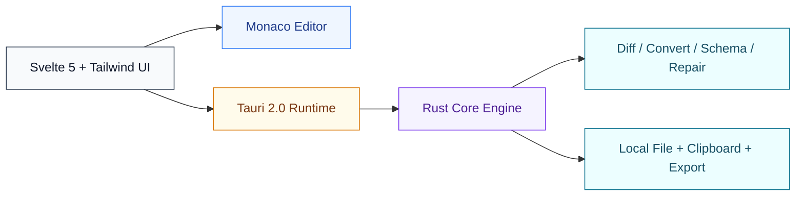

**English** | [中文](README_ZH.md)

# JsonStudio

### JSON Prettify · Viewer · Diff · Converter · Schema · Code Gen

Free, open-source JSON desktop app built with Tauri 2.0 and Rust.

desktop-native · privacy-first · shortcut-driven workflow

## Overview

A fast, modern, and efficient JSON desktop tool. Prettify, view, diff, convert, validate, and generate code - all in one app, powered by Tauri and Rust.

## Screenshot

| Dark Theme | Light Theme |
|---|---|
| _Application screenshots coming soon_ | _Application screenshots coming soon_ |

<!-- TODO: add dark/light app screenshots -->

## Core Features

Built for daily JSON work: Prettify, Viewer, Diff, Converter, JSON Schema, Code Gen, and Minify/Escape.

### 1) Professional JSON Prettify & Viewer
Built on Monaco Editor (the engine of VS Code), delivering a top-tier JSON prettify and viewing experience.

- Syntax highlighting with bracket pair colorization
- Multi-tab editing with drag-and-drop reordering
- Code folding, minimap, and find and replace
- Auto-prettify on paste for instantly clean JSON
- 10+ color themes including Dracula, Nord, and One Dark

### 2) Tree View & JMESPath Query
Visualize complex JSON structures as an interactive tree. Navigate, search, and query with ease.

- Collapsible tree with type-colored icons
- Click any node to jump to its position in the editor
- Copy path and value with one click
- Full JMESPath query support with real-time highlighting
- Resizable panel width for comfortable viewing

### 3) JSON Converter & Code Gen
Convert JSON to YAML, XML, TOML, and CSV, or generate type-safe code in your favorite language.

- Bidirectional conversion: JSON <-> YAML, XML, TOML, CSV
- CSV rainbow column highlighting for readability
- Generate TypeScript, Go, Python, Java, Rust, and more
- Reverse conversion: paste code to extract JSON

### 4) JSON Schema Generation & Validation
Generate JSON Schema from any JSON data, or validate your data against an existing schema - all in a dedicated view.

- One-click schema generation from JSON data
- Validate JSON against any JSON Schema with detailed error reports
- Dedicated schema page with side-by-side editing

### 5) JSON Diff
Visual comparison for JSON changes, optimized for readable and fast review.

- Side-by-side diff with inline change highlighting
- Diff line count statistics in status bar
- Fast change spotting in large JSON documents

### 6) File Operations & Utilities
Practical daily tools for handling local JSON files and export workflows.

- Escape, unescape, and minify utilities
- Drag and drop JSON files to open instantly
- File association: double-click `.json` to open directly
- Export JSON as beautiful images with syntax highlighting for easy sharing

### 7) Shortcuts & Workflow Boost
Native desktop shortcuts that web tools simply cannot offer - dramatically speed up your daily JSON workflow.

- Global shortcut to launch or bring the app to front instantly
- One-key paste and prettify: clean up clipboard JSON instantly
- Window always-on-top toggle for multitasking
- All editor shortcuts fully customizable in settings

## And Much More

| Built-in Capability | Description |
|---|---|
| JSON Repair | One-click auto-repair of invalid JSON - fix missing quotes, trailing commas, and more |
| Lightweight | Small install size and low memory footprint, powered by Tauri and Rust |
| Instant Launch | Launches in under a second. No loading screens, no waiting |
| Cross-Platform | Available on macOS, Windows, and Linux with native look and feel |
| 10+ Themes | Dracula, Nord, One Dark, Solarized, and more. Switch between light and dark with one click |
| JSON Statistics | Real-time display of key count, nesting depth, byte size, and line count |
| i18n Support | Full Chinese and English interface with one-click language switching |
| 100% Offline | All data stays on your machine. No server, no upload, complete privacy |

## Why JsonStudio? (vs Online Tools)

| Feature | Online Tools | JsonStudio |
|---|---:|---:|
| Offline / No Internet Required | ✗ | ✓ |
| Data Privacy (100% Local) | ✗ | ✓ |
| Large JSON Data Performance | ✗ | ✓ |
| Multi-tab Editing | ✗ | ✓ |
| Tree View & JMESPath Query | ✗ | ✓ |
| Ad-Free Experience | ✗ | ✓ |
| Global Shortcuts & Custom Keybindings | ✗ | ✓ |
| Image Export | ✗ | ✓ |
| Local File Operations | ✗ | ✓ |
| Custom Settings (Theme, Font, Spacing, Shortcuts...) | ✗ | ✓ |
| JSON Schema Generation & Validation | ✓ | ✓ |
| Code Generation | ✓ | ✓ |
| JSON Converter (YAML/XML/...) | ✓ | ✓ |
| JSON Diff | ✓ | ✓ |

## Get Started in Seconds

| Step | Action | Description |
|---|---|---|
| 1 | Download | Grab the installer for your platform from GitHub Releases |
| 2 | Launch | Open the app - it launches in under a second |
| 3 | Paste | Paste your JSON and it is auto-prettified instantly |
| 4 | Done | Prettify, view, minify, diff, convert, and generate code - all at your fingertips |

## Architecture

## Download

Get the installer from [Releases](https://github.com/sundegan/JsonStudio/releases).

## Tech Stack

- **Desktop**: Tauri 2.0
- **Backend**: Rust
- **Frontend**: Svelte 5 + Tailwind CSS + Monaco Editor

---

 

If this project helps you, please give it a ⭐️ Star.

