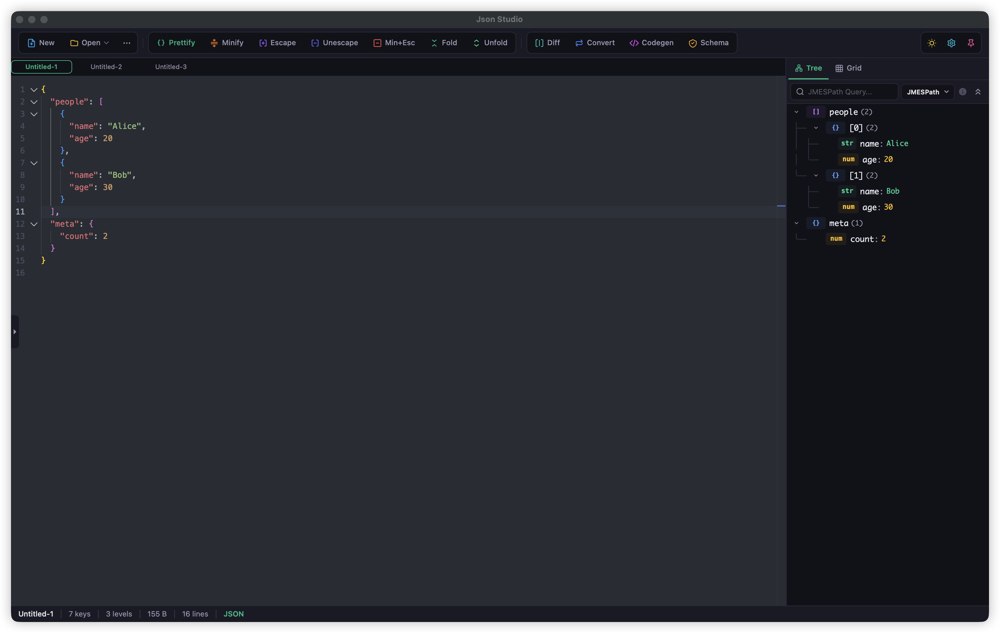
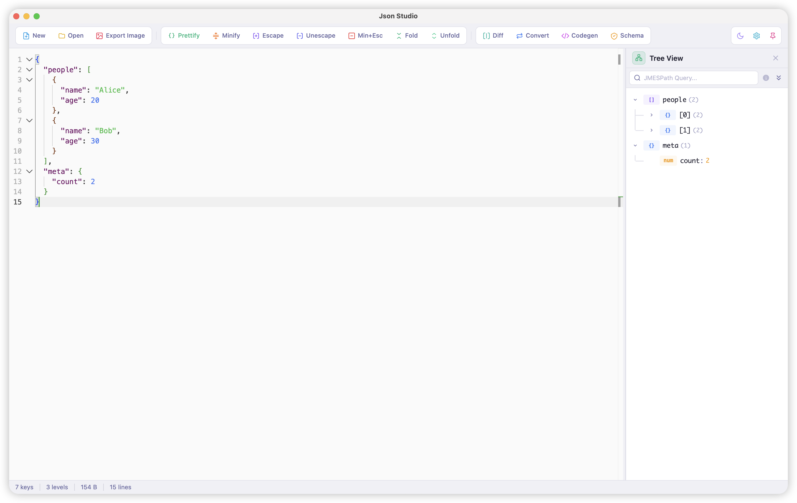
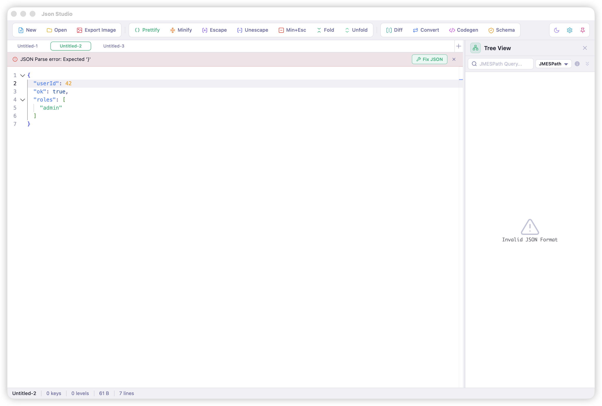
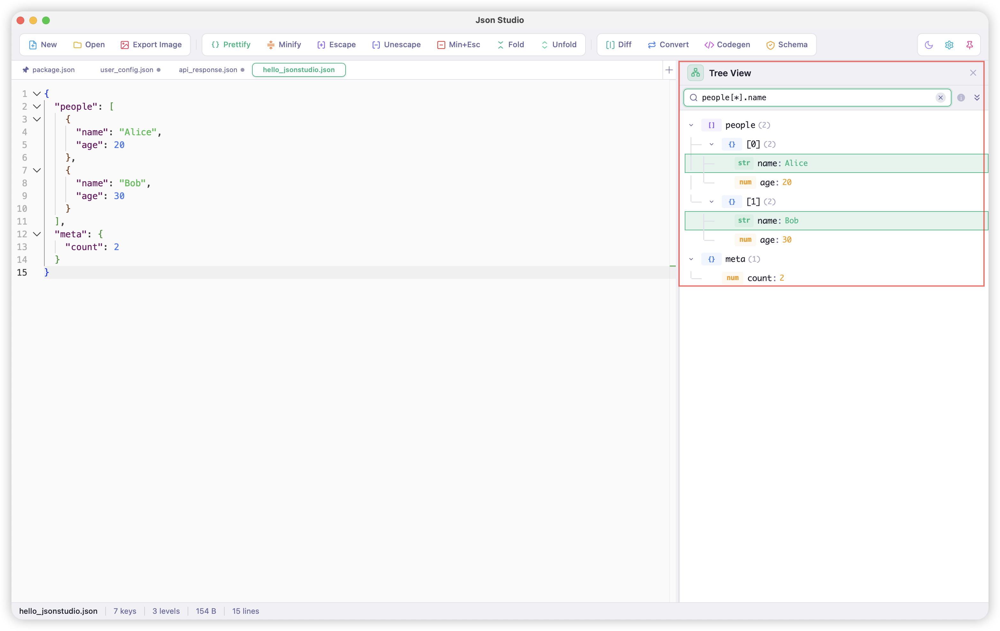
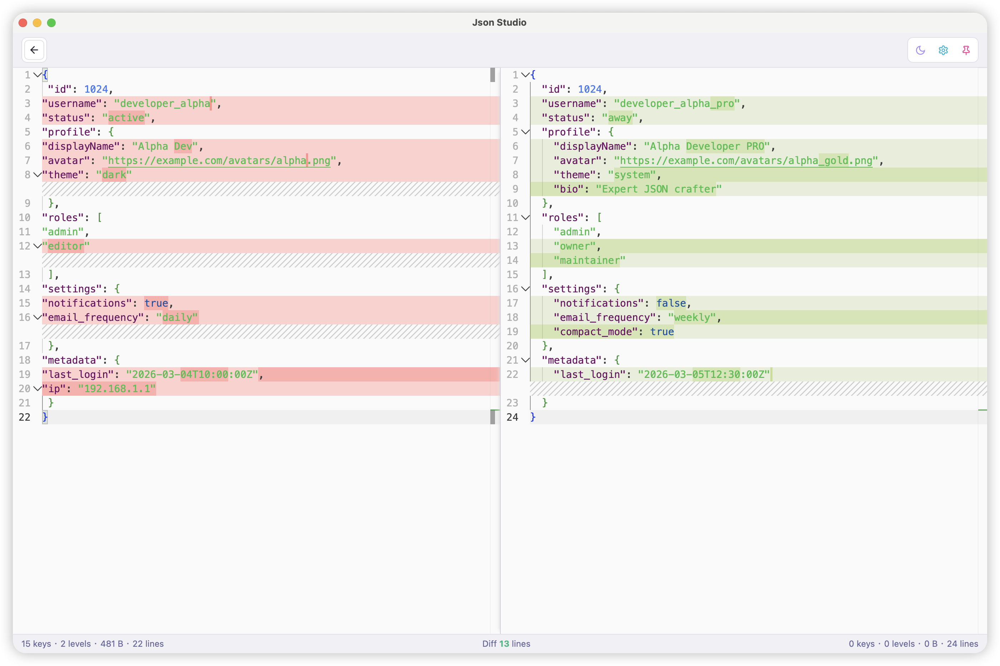
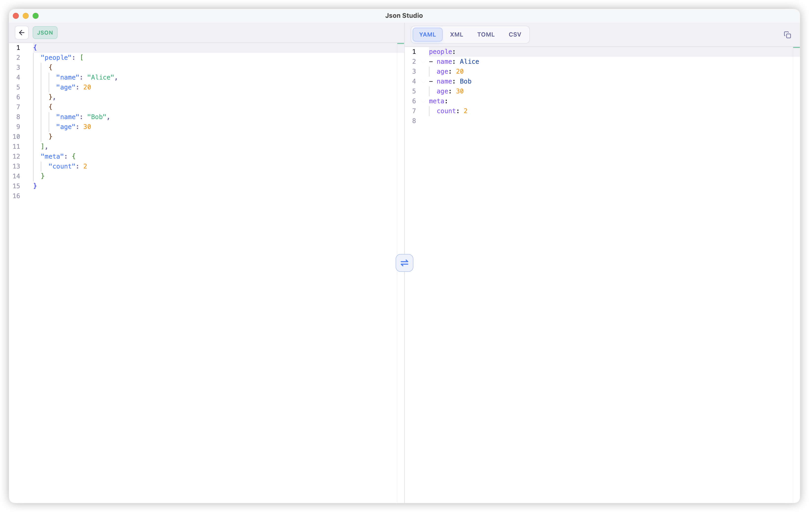
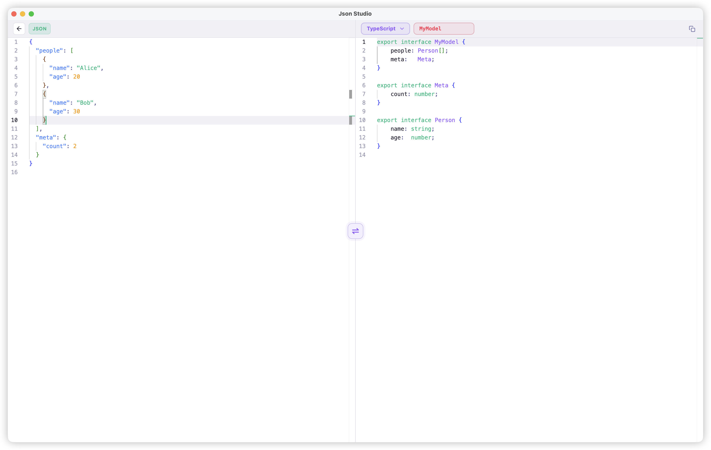
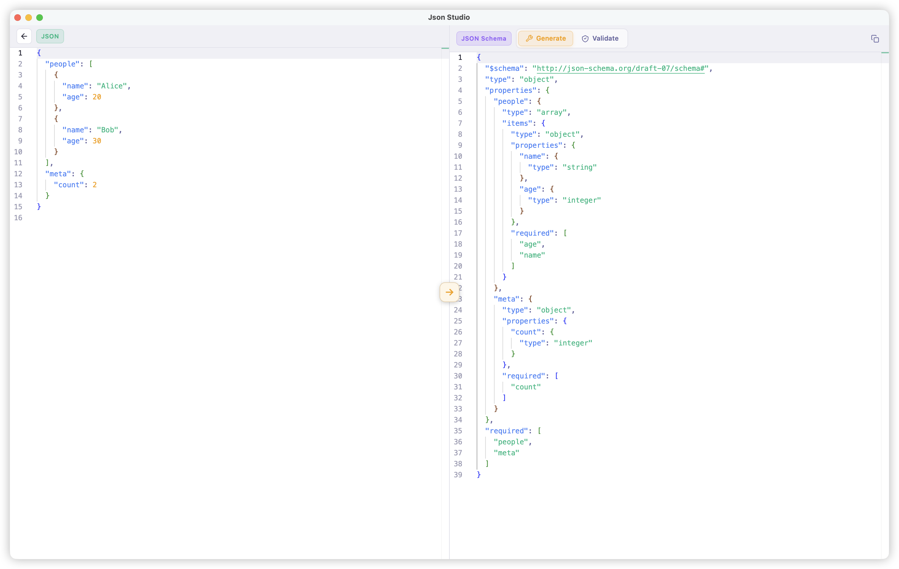

**English** | [中文](README_ZH.md)

# JsonStudio

### A fast, private JSON workspace for everyday development

Prettify, inspect, compare, convert, validate, and extract JSON from real-world logs - all locally in a native desktop app.

**[jsonstudio.js.org](https://jsonstudio.js.org/)** · **[Download](https://github.com/sundegan/JsonStudio/releases)**

  
  
  
  
  
  

all-in-one JSON workspace · professional developer experience · native-speed performance

## Preview

## What Makes It Different

JsonStudio is built for JSON in real development work: API requests and responses, deeply nested data, escaped strings, JSON5-like snippets, and log lines where plain text and JSON are mixed together.

- **Local-first desktop app**: no network required, no browser required, no ads, a polished UI, shortcut support, and no more jumping between a pile of web tabs.
- **Smarter formatting**: supports standard JSON, JSON-like/JSON5 input, escaped JSON strings, JSON with trailing commas, JSON with unquoted keys, automatic repair attempts for problematic JSON data, and paste auto-formatting.
- **Log-like text and JSON mixed content formatting**: keeps the original log unchanged, extracts JSON fragments automatically, and displays structured results separately for easier log data inspection.
- **Better reading and review**: tree view, JMESPath/JSONPath query, real-time statistics, and JSON diff make complex JSON data easier to understand.
- **Details that fit daily use**: preserves original object key order by default, keeps JSON editing operations undoable, and reuses existing tabs when reopening files.
- **Developer tools**: prettify, minify, escape, unescape, minify + escape, fold, unfold, JSON Schema generation/validation, JSON <-> YAML/XML/TOML/CSV conversion, and typed code generation.
- **Smooth file workflow**: multi-tabs, auto-numbered Untitled tabs, reused tabs for reopened files, unsaved-change prompts, optional auto-save, drag-and-drop JSON opening, and direct opening by double-clicking JSON files.

## Features

### Edit & Inspect

Built on Monaco Editor, JsonStudio provides a top-tier JSON prettify and viewing experience with syntax highlighting, code folding, find/replace, bracket coloring, light/dark mode, and 10+ themes.

### Tree View & Search

Use the tree view to navigate nested data, copy paths or values, and query with JMESPath or JSONPath when a payload is too large to scan manually.

### Compare, Convert, Generate

Compare JSON side by side, convert between common data formats, generate typed models, or extract JSON back from supported code snippets.

### Validate With Schema

Generate JSON Schema from data, validate JSON against a schema, and inspect detailed validation errors in a dedicated workspace.

## Why JsonStudio? (vs Online Tools)

| Capability | Online Tools | JsonStudio |
|---|---:|---:|
| Works fully offline with local files | Limited | Yes |
| Keeps sensitive JSON on your machine | Risky | 100% local |
| Handles JSON, JSON5-like input, escaped JSON, and repairable fragments | Partial | Built in |
| Extracts JSON from log-like mixed text | Rare | Yes |
| Tree view with JMESPath/JSONPath query | Partial | Yes |
| Multi-tab workflow with unsaved prompts and optional auto-save | No | Yes |
| Native shortcuts, format clipboard, always-on-top window | No | Yes |
| Diff, convert, schema validation, and code generation in one app | Fragmented | Unified |

## Download

Download the latest installer from [GitHub Releases](https://github.com/sundegan/JsonStudio/releases).

### macOS

1. Download the DMG for your Mac architecture (`aarch64` for Apple Silicon, `x64` for Intel).
2. Open the DMG and drag `Json Studio.app` into Applications.
3. On first launch, if macOS blocks the app because it is from an unidentified developer, right-click `Json Studio.app` and choose **Open**, or allow it in **System Settings > Privacy & Security**.

Current macOS builds are not Apple Developer ID notarized, so the first launch may require manual confirmation.

## Tech Stack

- **Desktop**: Tauri 2.0 + Svelte 5 + Monaco Editor
- **Core**: Rust + Javascript

---

If JsonStudio helps your daily JSON work, a star would mean a lot.

