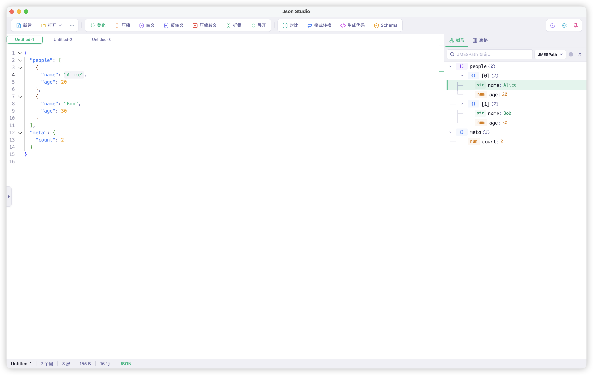
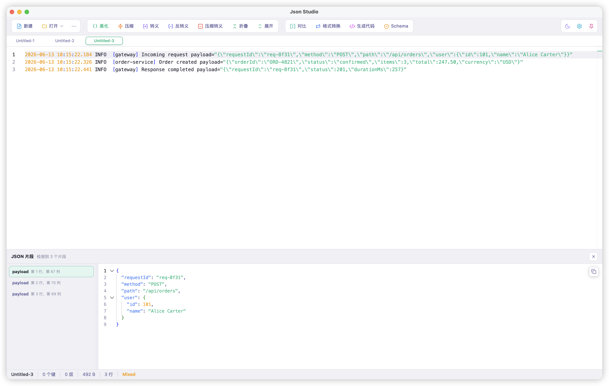
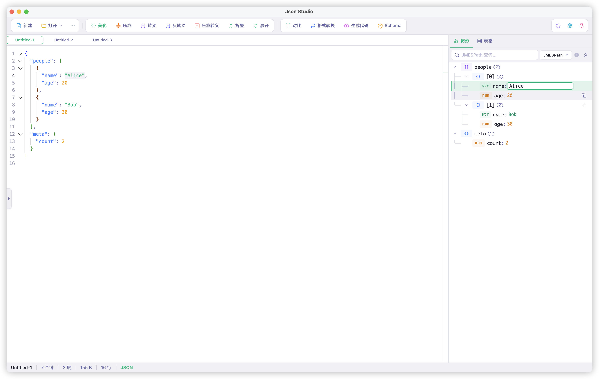
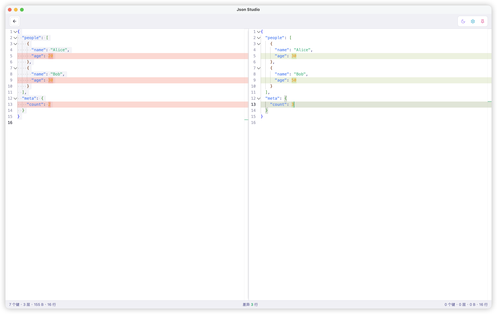
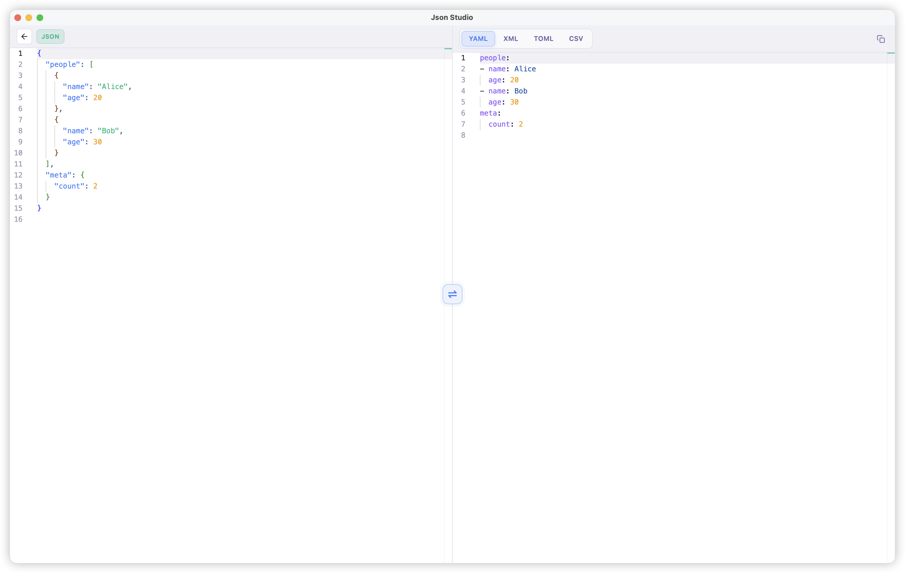
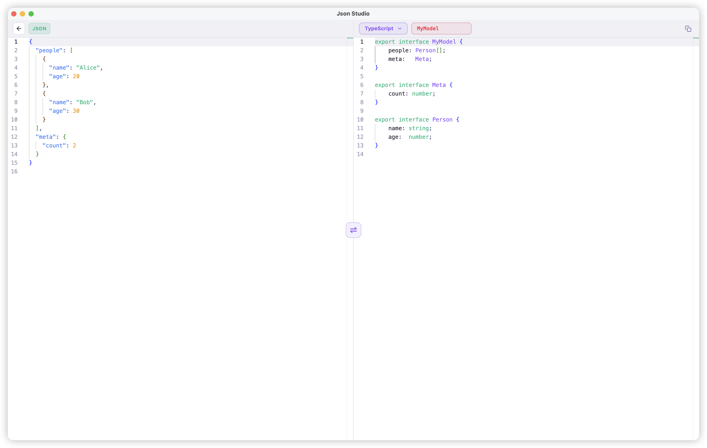
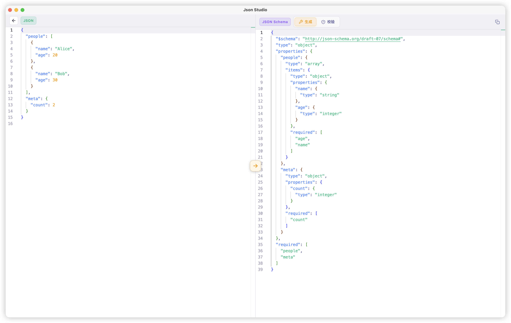

<div align="center">

[English](README.md) | **中文**

# JsonStudio

### 面向日常开发的本地 JSON 工作台

美化、查看、对比、转换、校验，也能从真实日志里提取 JSON - 全部在本地桌面应用中完成。

**[jsonstudio.js.org](https://jsonstudio.js.org/)** · **[下载安装](https://github.com/sundegan/JsonStudio/releases)**

<p align="center">
  <a href="https://jsonstudio.js.org/">
    
  </a>
  <a href="https://github.com/sundegan/JsonStudio/releases">
    
  </a>
  
  
  
  
</p>

<sub>全能 JSON 工作台 · 专业开发体验 · 原生极速性能</sub>

</div>

## 预览

<p align="center">
  <a href="https://jsonstudio.js.org/zh/#screenshots">
    
  </a>
</p>

<p align="center"><sub>格式化剪贴板 JSON，在树视图中编辑和拖拽数据，在 Grid 网格视图中编辑数组，并从日志中提取 JSON。</sub></p>

## JsonStudio 的特点

JsonStudio 面向真实开发场景里的 JSON —— 接口请求/响应、复杂嵌套数据、转义字符串、类 JSON/JSON5 片段，以及普通日志文本和 JSON 混在一起的内容。

- **本地优先的桌面应用**：无需网络、无需浏览器、无广告、美观的界面、支持快捷键，不用在一堆网页标签里切来切去。
- **更聪明的格式化**：支持标准 JSON、类 JSON/JSON5、被转义的 JSON 字符串、带尾逗号的JSON、key未加引号的JSON，尝试自动修复有问题的JSON数据，以及粘贴后自动格式化。
- **日志类文本与 JSON 混合内容格式化**：保留原始日志不变，自动提取其中的 JSON 片段，并单独展示结构化结果，方便查看复杂日志数据。
- **不只是查看，还能可视化编辑**：在树视图中双击编辑值、拖拽调整节点结构，或使用 Grid 网格视图像操作表格一样查看和编辑数组。
- **更适合阅读和审查**：JMESPath/JSONPath 查询、实时统计、JSON 对比，让复杂 JSON 数据更容易看懂。
- **细节更贴近日常使用**：默认保留对象 key 原始顺序，JSON编辑操作可撤销，重复打开文件时复用已有标签。
- **开发者常用工具**：美化、压缩、转义、反转义、压缩转义、折叠、展开、JSON Schema 生成/校验、JSON 与 YAML/XML/TOML/CSV 互转、类型代码生成。
- **顺手的文件体验**：多标签、Untitled 自动编号、重复打开文件复用标签、未保存提示、可选自动保存、拖拽JSON文件打开、双击JSON文件直接打开等。

## 功能

### 编辑与查看



基于 Monaco Editor 打造，提供顶级的 JSON 美化与查看体验。支持语法高亮、代码折叠、查找替换、括号对着色、明暗模式切换、10+主题。

### 多格式输入支持



支持标准 JSON、类 JSON/JSON5、转义 JSON 字符串、尾逗号、未加引号的 key，以及日志文本与 JSON 混合输入。保留原始文本不变，同时提取并展示结构化 JSON 结果，便于排查和审查。

### 树视图与 Grid 网格视图编辑



双击 key 或 value，即可在树视图中直接编辑；拖拽节点，可以可视化调整嵌套 JSON 的结构和顺序。切换到 Grid 网格视图后，还能像操作表格一样查看和编辑数组数据。树视图、Grid 视图与源码编辑器保持同步，并支持使用 JMESPath 或 JSONPath 快速定位数据。

### 对比、转换、生成代码







支持并排 JSON 对比、常见数据格式转换、类型代码生成，也可以从支持的代码片段中反向提取 JSON。

### Schema 生成与校验



从 JSON 一键生成 Schema，或用已有 Schema 校验 JSON，并在专属视图中查看详细错误。

## 为什么选择 JsonStudio（对比在线工具）

| 能力 | 在线工具 | JsonStudio |
|---|---:|---:|
| 离线使用与本地文件处理 | 有限制 | 支持 |
| 敏感 JSON 数据不离开本机 | 有风险 | 100% 本地处理 |
| 处理 JSON、类 JSON/JSON5、转义 JSON、可修复片段 | 部分支持 | 内置支持 |
| 从日志类混合文本中提取 JSON | 少见 | 支持 |
| 可编辑、可拖拽的树视图与可编辑 Grid 网格视图 | 少见 | 内置支持 |
| JMESPath/JSONPath 查询 | 部分支持 | 支持 |
| 多标签、未保存提示、可选自动保存 | 通常不支持 | 支持 |
| 原生快捷键、格式化剪贴板、窗口置顶 | 不支持 | 支持 |
| Diff、转换、Schema 校验、代码生成一站式完成 | 分散 | 统一 |

## 下载

前往 [GitHub Releases](https://github.com/sundegan/JsonStudio/releases) 下载对应平台安装包。

### Homebrew（macOS）

```sh
brew install --cask sundegan/tap/json-studio
```

### macOS

1. 下载适合你设备架构的 DMG（Apple Silicon 选 `aarch64`，Intel Mac 选 `x64`）。
2. 打开 DMG，将 `Json Studio.app` 拖入“应用程序”文件夹。
3. 首次打开时，如果 macOS 提示来自未识别开发者，请右键 `Json Studio.app` 选择“打开”，或到“系统设置 > 隐私与安全性”中允许打开。

当前 macOS 安装包未经过 Apple Developer ID 公证，因此首次打开可能需要手动确认。

## 技术栈

- **桌面**：Tauri 2.0 + Svelte 5 + Monaco Editor
- **核心能力**：Rust + Javascript

---

<div align="center">

如果 JsonStudio 对你的日常 JSON 工作有帮助，欢迎点个 Star 支持一下。

</div>
