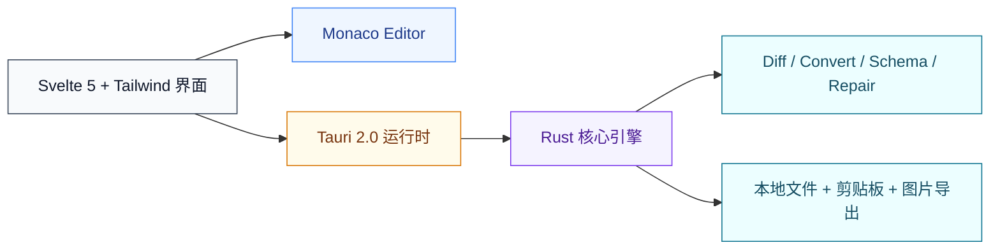

[English](README.md) | **中文**

# JsonStudio

### JSON 美化 · JSON 查看 · JSON Diff · JSON Converter · JSON Schema · Code Gen

免费开源的 JSON 桌面应用，基于 Tauri 2.0 与 Rust 构建。

原生桌面 · 隐私优先 · 快捷键驱动工作流

## 产品简介

快速、现代、高效的 JSON 桌面工具。美化、查看、Diff、转换、校验、代码生成 - 一个应用全搞定，基于 Tauri 和 Rust 构建。

## 应用截图

| 深色主题 | 浅色主题 |
|---|---|
| _应用截图即将上线_ | _应用截图即将上线_ |

<!-- TODO: 添加深色/浅色应用截图 -->

## 核心功能

专为日常 JSON 工作打造：美化、查看、Diff、Converter、Schema、Code Gen、压缩/转义，一站式完成。

### 1) 专业级 JSON 美化与查看器
基于 Monaco Editor（VS Code 编辑器内核）打造，提供顶级的 JSON 美化与查看体验。

- 语法高亮与括号对着色
- 多标签页编辑，支持拖拽排序
- 代码折叠、缩略图和查找替换
- 粘贴自动美化，瞬间得到干净 JSON
- 明暗模式切换 + 10+ 配色主题，包括 Dracula、Nord、One Dark

### 2) 树视图与 JMESPath 查询
将复杂的 JSON 结构可视化为交互式树形图，轻松导航、搜索和查询。

- 可折叠树结构，节点按类型着色
- 点击节点跳转到编辑器对应位置
- 一键复制路径和值
- 完整的 JMESPath 查询支持，实时高亮匹配
- 面板宽度可调节，舒适查看

### 3) JSON Converter 与 Code Gen
将 JSON 转换到 YAML、XML、TOML、CSV，或生成你偏好的类型安全代码。

- 双向转换：JSON <-> YAML、XML、TOML、CSV
- CSV 彩虹列高亮，提升可读性
- 生成 TypeScript、Go、Python、Java、Rust 等语言代码
- 反向转换：粘贴代码提取 JSON

### 4) JSON Schema 生成与验证
从任意 JSON 数据一键生成 Schema，或用现有 Schema 验证数据，并在专属视图中完成操作。

- 一键从 JSON 数据生成 Schema
- 根据 JSON Schema 验证数据，提供详细错误报告
- 专属 Schema 页面，支持并排编辑

### 5) JSON Diff
为 JSON 变更提供清晰直观的可视化对比，提升审查效率与可读性。

- 并排 Diff 对比，内联变更高亮
- 状态栏显示差异行数统计
- 大体量 JSON 的变更定位更直观

### 6) 文件操作与实用工具
覆盖日常本地 JSON 文件处理与导出需求。

- 转义、反转义、压缩工具
- 拖拽 JSON 文件即可打开
- 文件关联：双击 `.json` 文件直接打开
- 导出 JSON 为带语法高亮的美观图片，便于向他人分享

### 7) 快捷键与工作流加速
原生桌面快捷键是网页工具无法实现的 - 大幅提升你的日常 JSON 工作效率。

- 全局快捷键一键启动或唤起应用到前台
- 一键粘贴并美化：立即格式化剪贴板中的 JSON 并展示
- 窗口置顶切换，方便多任务协作
- 所有编辑器快捷键均可在设置中自定义

## 还有更多

| 内置能力 | 说明 |
|---|---|
| JSON 修复 | 一键自动修复无效 JSON - 修复缺失引号、尾逗号等常见问题 |
| 轻量小巧 | 安装包小、内存占用低，基于 Tauri 和 Rust 构建 |
| 秒级启动 | 不到一秒即可启动，无加载画面，无需等待 |
| 跨平台 | 支持 macOS、Windows 和 Linux，原生外观和体验 |
| 10+ 主题 | Dracula、Nord、One Dark、Solarized 等，一键切换明暗主题 |
| JSON 统计 | 实时显示键数量、嵌套深度、字节大小和行数 |
| 国际化 | 完整的中英文界面，一键切换语言 |
| 完全离线 | 所有数据留在本地，无服务器、无上传，完全保护隐私 |

## 为什么选择 JsonStudio（对比在线工具）

| 功能 | 在线工具 | JsonStudio |
|---|---:|---:|
| 离线使用 / 无需联网 | ✗ | ✓ |
| 数据隐私（100% 本地处理） | ✗ | ✓ |
| 大 JSON 数据性能 | ✗ | ✓ |
| 多标签页编辑 | ✗ | ✓ |
| 树视图与 JMESPath 查询 | ✗ | ✓ |
| 无广告体验 | ✗ | ✓ |
| 全局快捷键与自定义键绑定 | ✗ | ✓ |
| 图片导出 | ✗ | ✓ |
| 本地文件操作 | ✗ | ✓ |
| 自定义设置（主题、字号、间距、快捷键等） | ✗ | ✓ |
| JSON Schema 生成与验证 | ✓ | ✓ |
| 代码生成 | ✓ | ✓ |
| JSON Converter（YAML/XML/...） | ✓ | ✓ |
| JSON Diff | ✓ | ✓ |

## 快速上手

| 步骤 | 动作 | 说明 |
|---|---|---|
| 1 | 下载 | 从 GitHub Releases 获取你平台的安装包 |
| 2 | 启动 | 打开应用 - 不到一秒即可启动 |
| 3 | 粘贴 | 粘贴你的 JSON，自动美化 |
| 4 | 完成 | 美化、查看、压缩、对比、转换、生成代码 - 尽在指尖 |

## 架构图

## 下载

前往 [Releases](https://github.com/sundegan/JsonStudio/releases) 下载对应平台安装包。

## 技术栈

- **桌面框架**：Tauri 2.0
- **后端语言**：Rust
- **前端框架**：Svelte 5 + Tailwind CSS + Monaco Editor

---

 

如果这个项目对你有帮助，欢迎点个 ⭐️ Star 支持一下。

